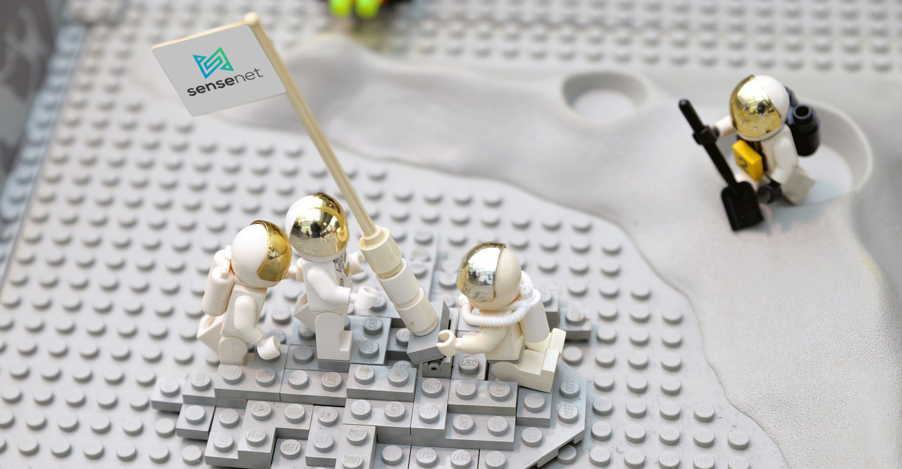

---

title: "2020 sum-up"
author: [molnarm84, huszerlbence]
image: "../img/posts/2020_sumup_WHEW.jpg"
tags: [website, headless cms, SNaaS, SaaS]
redirect_to: https://www.sensenet.com/blog/2020-12-08-2020-sum-up

---

2020 was a looooong and productive year for us. A lot of things happened with one common goal: launch sensenet as a service (or SNaaS for short).

---

This year was dedicated to SNaaS launch preparation which has generated various tasks in different fields like marketing, sales and development. Fortunately we were mostly able to stick to our plans defined at the beginning of the year.
Below, you can see our timeline for 2020 with the important milestones and happenings.

# Q1 The plan
At the first quarter we started to define tasks and goals for the whole year. By the end of Q1 only one thing was sure: we wanted to launch SNaaS in BETA along with Hacktoberfest. This meant we had to have our new website up and running with fresh new content to promote the new service.
We hired a professional marketing agency to help us with the content creation. In addition to the website revamp, we entrusted them to get new users for SNaaS. This part will happen in 2021, once we end BETA phase and launch the service.

# Q2 Struggle

This quarter was quite busy since we needed to work on many different areas at the same time.

To understand the processes and the tasks we should work on, lot of customer journeys have been drawn.
We defined that we require (to mention a few):
- profile page where users manage their account and subscriptions
- surface to manage under the hood processes in-house (e.g: repository creation, account management, invoicing)
- email templates

Of course every step led to new questions and additional tasks.🥳

In the meantime our awesome DevOps guy worked really hard in the background to figure out how sensenet could become a containerized application and planned the whole infrastructure along with the System Engineers.

Concerning the new website we discussed a lot with the marketing agency to help them understand sensenet and the target audience of the new service. During this period we lived mostly in Microsoft Wor(l)d polishing our communication.

# Q3 Ready?
We needed a website design so we created one. Of course it came with a lof of modifications hundreds of versions and some user tests.

By the middle of september the new website gone live but we weren't nearly ready for Hacktoberfest.
We also needed some (at least 60) new Hacktoberfest tagged tasks, a dedicated website and in-house testing of every step of the new service (from registration to content management)

# Q4 Whew..
After Hacktoberfest which - was less hyped this year than we thought - we started to work on automations and other optimization tasks.

During the event we collected what we could automate from our processes and currently we are implementing these steps.
We also looked into analytics and hotjar results to find the weak points of the new site so we constantly improving user experience based on these infos.

Since we want to launch a marketing campaign early next year, we started the preparation in the form of daily social media posts and monthly blogposts.

This is pretty new to us so we need some time to get used to this activity. Great that we started this in time.😊

# 2021 - A new beginning

Next year we can reap the fruit of our hard work since we're going to launch SNaaS in Q1 but before that we need to heck some boxes like API and penetration tests, finalize our live infrastructure and get everything ready for the marketing campaign.

See you next year!🎄🎉
